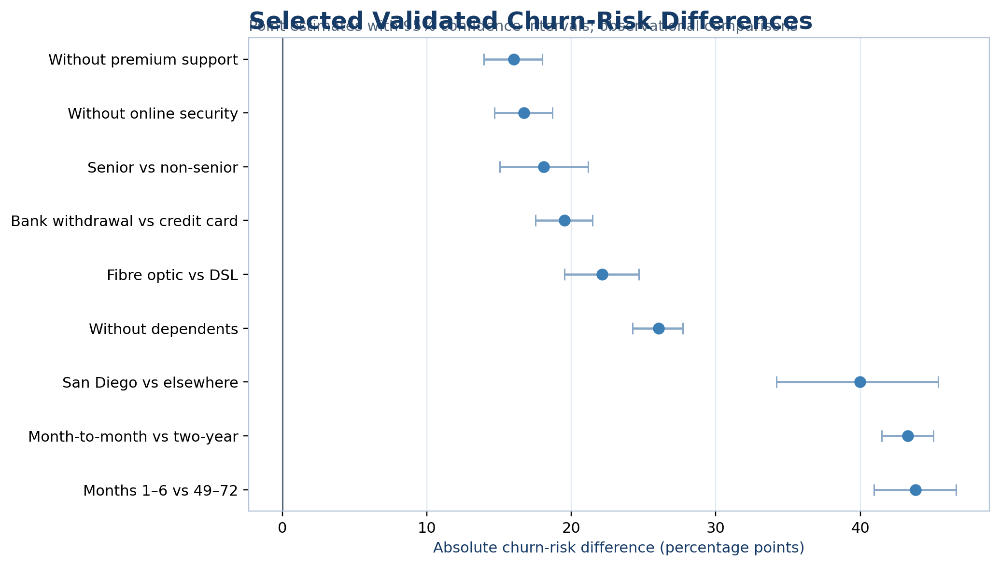
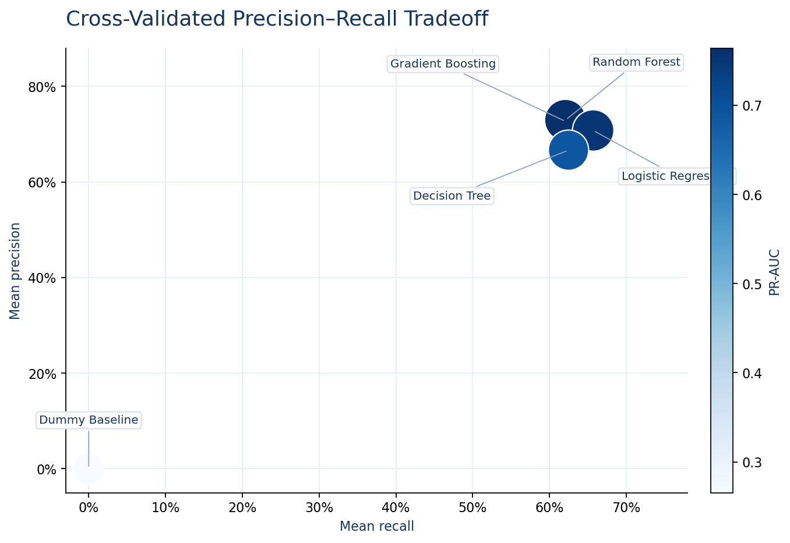
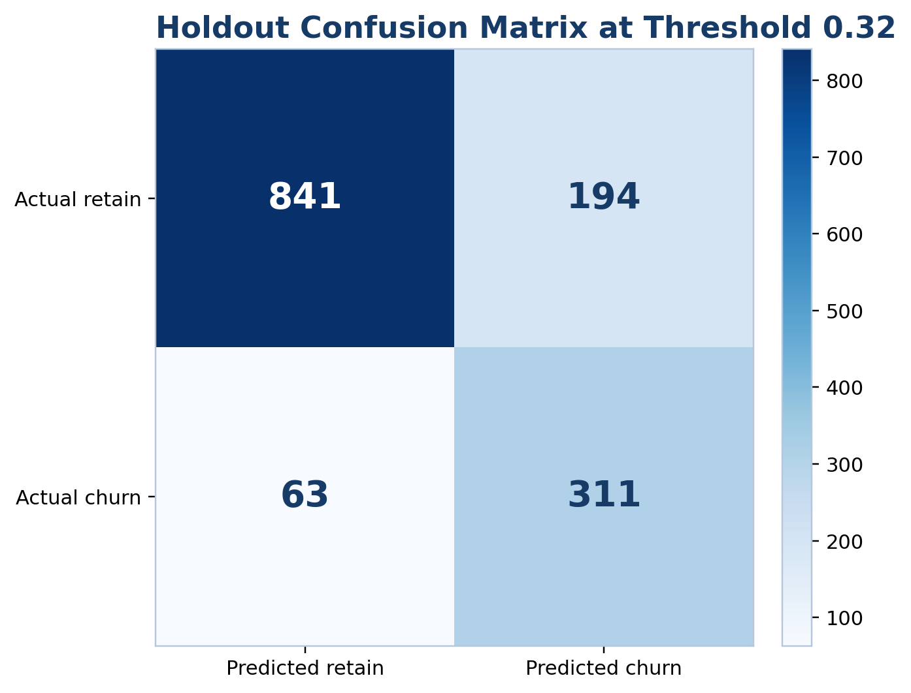
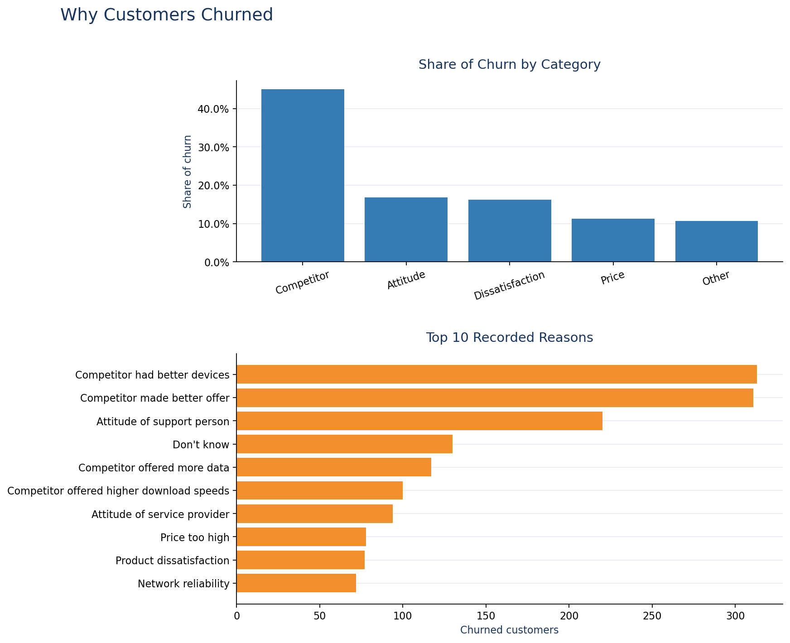
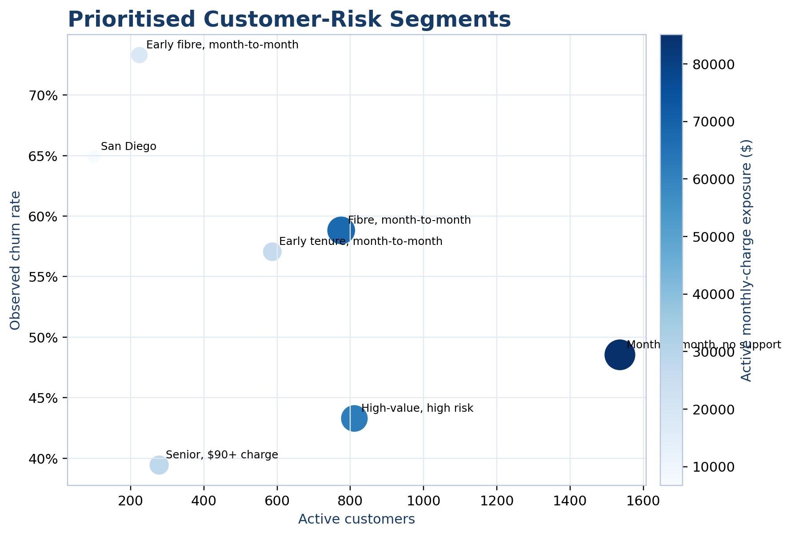
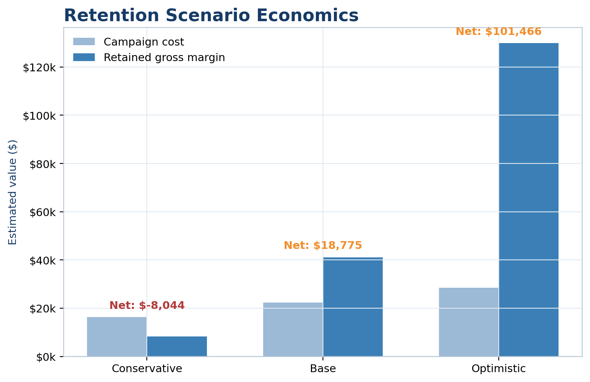
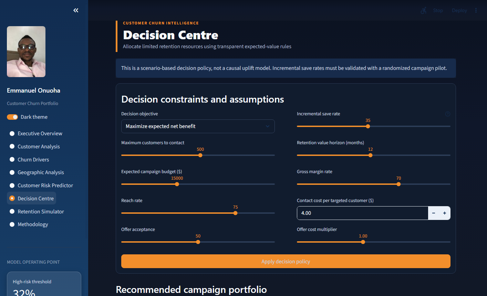

# Predicting Telecom Customer Churn and Optimising Retention Decisions

## An Explainable and Prescriptive Analytics Approach

**Emmanuel Onuoha**

Independent Data Analytics Portfolio Project

21 August 2026

{{PROFILE}}

**Developed and Designed by Emmanuel Onuoha**

- GitHub: https://github.com/Emmydutch/Customer-Churn-portfolio
- Interactive application: https://customer-churn-portfolio-z3hvzwkxs3yu8zvenx9yuk.streamlit.app/
- Kaggle profile: https://www.kaggle.com/onuohaemmanuel

> Publication status: Independent technical report. This work has not been peer reviewed. The dataset is fictional and the retention outcomes are scenario estimates rather than observed causal effects.

{{PAGEBREAK}}

## Abstract

Customer churn creates avoidable revenue exposure and raises acquisition pressure for subscription businesses. This applied analytics project develops an end-to-end framework for identifying telecom customers with elevated churn risk and translating risk estimates into transparent retention decisions. The analysis uses a public-domain fictional telecom dataset containing 7,043 customer records. It combines data-quality controls, leakage governance, exploratory and cohort analysis, confidence intervals and effect sizes, interpretable classification, calibration assessment, threshold selection, customer-level explanations, and scenario-based campaign economics. The observed churn rate was 26.54% (95% confidence interval: 25.52%–27.58%). Strong descriptive associations were observed for early tenure, month-to-month contracts, fibre-optic service, absence of support and security services, senior status, and selected geographic concentrations. A leakage-safe logistic-regression pipeline achieved a holdout ROC-AUC of 0.8985 and recall of 0.8316 at a decision threshold of 0.32. The selected operating point prioritised recall while retaining explicit precision and workload trade-offs. A subsequent prescriptive layer ranked active customers and interventions using expected-value rules under campaign budget and capacity constraints. Under the stated base assumptions, 947 customers were eligible, approximately 65.92 customers were expected to be saved, and estimated net benefit was $18,775. These figures are planning estimates, not realised uplift. The work demonstrates how predictive modelling can be connected to operational decisions without confusing correlation, prediction, and causation.

**Keywords:** customer churn; telecom analytics; classification; explainable artificial intelligence; calibration; prescriptive analytics; retention strategy; decision support

## 1. Introduction

Telecommunications companies operate in markets where customers can compare offers, change providers, and reassess service value frequently. Churn therefore affects recurring revenue, customer lifetime value, service planning, and the cost of replacing lost customers. A useful churn project must do more than describe customers who have already left. It should help decision makers determine whom to contact, why a customer has been prioritised, which intervention is appropriate, and whether the proposed action is economically defensible.

The central question for this project is: **Which customers are most likely to churn, why are they leaving, and what actions could improve retention?** The work addresses that question through three connected analytical layers. The descriptive layer measures the portfolio and identifies unusually exposed segments. The predictive layer estimates pre-churn risk using variables that could plausibly be available at decision time. The prescriptive layer converts estimated risk into campaign recommendations subject to explicit assumptions and constraints.

The principal contribution is not a novel machine-learning algorithm. It is a reproducible decision-support workflow that treats data provenance, leakage, threshold choice, calibration, interpretability, economic assumptions, and responsible use as first-class design requirements. This orientation is suitable for executive and operational audiences who need traceable recommendations rather than an isolated accuracy score.

## 2. Business Problem and Objectives

In this dataset, a churned customer is a customer whose recorded status indicates that the telecom relationship ended. The business objective is to reduce preventable churn while avoiding indiscriminate discounts and excessive contact costs. The analysis was designed for executives, commercial leaders, customer-experience teams, retention managers, and analysts.

The objectives were to:

- quantify churn, retention, customer value, tenure, and revenue exposure;
- identify demographic, contractual, service, support, geographic, and experience patterns associated with churn;
- distinguish pre-churn predictors from fields that reveal or follow the outcome;
- compare classification models using discrimination, calibration, recall, precision, and workload;
- explain portfolio-level and individual risk estimates;
- prioritise customer-treatment combinations under budget and capacity limits; and
- present results through a tested interactive application and reproducible analytical notebook.

Success was defined by analytical validity and decision usefulness rather than maximum accuracy. A credible solution needed to reproduce source-data calculations, prevent target leakage, provide understandable explanations, expose threshold trade-offs, and state the uncertainty surrounding retention economics.

## 3. Data and Governance

### 3.1 Dataset

The source contains 7,043 fictional telecom customer records and customer-level demographic, location, account, service, billing, satisfaction, churn-status, churn-category, and churn-reason fields. Dataset provenance and redistribution terms are documented in the accompanying repository notice. The data are identified as Public Domain; the original project code, writing, and visual design are separately released under the MIT Licence.

The target is whether the customer churned. The observed portfolio includes 1,869 churned customers and 5,174 current or otherwise non-churned customers, producing a churn rate of 26.54%. Because the dataset is a cross-sectional snapshot rather than a sequence of dated customer events, this percentage should not be described as a monthly or annual churn rate.

### 3.2 Data quality and preparation

The preparation workflow standardised column names, converted numeric fields, normalised categorical values, validated binary indicators, examined duplicates, and reconciled conditional missingness. Missing values in service-specific fields can be structurally meaningful—for example, customers without an internet service cannot meaningfully have an internet type. Preparation rules therefore distinguished unavailable concepts from unexplained missing data.

Business-oriented engineered features included tenure and age groups, monthly-charge bands, customer-value segments, service counts, support and protection counts, contract-risk groups, engagement profiles, and descriptive high-risk segments. These features improve communication but do not establish causal relationships.

### 3.3 Leakage governance

Outcome leakage was treated explicitly. `Churn Reason`, `Churn Category`, and `Customer Status` directly reveal or are recorded after the outcome and were excluded from predictive modelling. Churn reasons remain useful for retrospective diagnosis among customers who already left. Satisfaction score was also handled cautiously because its measurement timing is not fully documented. Customer identifiers and granular geography were retained for authorised operational display but not treated as generalisable behavioural causes.

This distinction prevents an unrealistically accurate model from appearing credible simply because it has learned fields that would not exist at scoring time.

## 4. Analytical Methods

### 4.1 Descriptive and cohort analysis

The analysis measured churn across demographics, contract type, tenure, internet service, monthly charges, payment method, support and security services, referrals, satisfaction, and geography. Tenure cohorts were used to distinguish early-lifecycle exposure from mature relationships. Composite segments were prioritised using customer volume, observed churn, active monthly-charge exposure, active customer lifetime value, and an opportunity index.

### 4.2 Statistical validation

Categorical associations were assessed using suitable contingency-table tests and effect-size measures. Important two-group differences were expressed as absolute risk differences and risk ratios with 95% confidence intervals. Numerical differences were assessed using distribution-aware comparisons and bootstrap confidence intervals. Statistical evidence was interpreted as observational association, not proof that changing a variable would cause churn to fall.

### 4.3 Predictive modelling

The modelling workflow used a stratified holdout set and cross-validation on the development data. Candidate models included logistic regression, decision tree, random forest, and gradient boosting, with a dummy classifier as the baseline. Preprocessing and estimation were implemented as pipelines to support reproducibility and reduce train–test contamination.

Models were compared with ROC-AUC, precision-recall AUC, Brier score, balanced accuracy, precision, recall, and F1. Logistic regression was selected because it delivered competitive discrimination, the strongest mean cross-validated recall among the substantive candidates, good calibration, and direct coefficient-based interpretability. This decision favoured operational transparency over a marginal increase in ranking performance.

### 4.4 Threshold and calibration assessment

The default 0.50 threshold was not assumed to be operationally optimal. Candidate thresholds were evaluated against false-negative exposure, false-positive workload, precision, recall, F1 and F2. A threshold of 0.32 was selected to emphasise recall because failing to identify an eventual churner can represent lost recurring value. At this point, the model flagged 505 of 1,409 holdout customers, with 311 true positives, 194 false positives, 63 false negatives, and 841 true negatives.

Calibration was evaluated using the Brier score, log loss, calibration intercept, calibration slope, and expected calibration error. Reliable probabilities matter because the prescriptive layer uses estimated churn probability in expected-value calculations.

### 4.5 Explainability and fairness checks

Global interpretation combined logistic-regression effects, permutation importance, and marginal prediction profiles. Customer-level explanations identified the characteristics that raised or lowered a particular score relative to the model background. Explanations were framed as model contributions rather than causal reasons.

Performance was examined across selected demographic groups. Fairness review is presented as monitoring rather than certification: subgroup metrics can be unstable, observed differences may reflect sampling and structural inequalities, and protected characteristics should not become automatic reasons to deny service or apply punitive treatment. Human review and outcome monitoring remain necessary.

### 4.6 Prescriptive decision framework

Risk scores alone do not determine action. For customer *i* and intervention *a*, the planning logic estimates expected retained value as a function of predicted churn probability, campaign reach, offer acceptance, incremental save rate, retention horizon, gross margin, and customer value. Expected net benefit subtracts contact and offer costs. Customers with positive estimated value are ranked and selected subject to campaign-capacity and budget constraints.

This is a scenario-based policy, not a causal uplift model. The assumed incremental save rate must be estimated through randomised treatment and control groups before production-scale spending.

## 5. Results

### 5.1 Portfolio and validated associations

The churn rate was 26.54% (95% CI: 25.52%–27.58%). Customers in months 1–6 had a churn risk 43.82 percentage points higher than customers in months 49–72 (95% CI: 40.96–46.61), corresponding to a risk ratio of 5.61. Month-to-month customers had a 43.30-point higher risk than two-year customers (95% CI: 41.48–45.04; risk ratio 17.98). These large differences support early-lifecycle and contract-design interventions, while remaining observational.

Fibre-optic customers had a 22.14-point higher churn risk than DSL customers (95% CI: 19.53–24.66). Customers without premium technical support had a 16.02-point higher risk than customers with support (95% CI: 13.96–18.00), while customers without online security had a 16.72-point higher risk (95% CI: 14.67–18.68). Senior customers showed an 18.08-point higher risk than non-senior customers (95% CI: 15.04–21.15). These results motivate service-quality investigation, support trials, and accessible assistance; they do not justify assuming that the observed attribute itself causes churn.

Among churned customers, competitor-related categories represented the largest share of recorded churn categories. The leading recorded reasons included better competitor devices, better offers, support-person attitude, additional data, and higher download speeds. Because these fields are only available after churn, they inform root-cause review and intervention design but were excluded from the prediction pipeline.

### 5.2 Priority segments

The highest-volume exposed segment was month-to-month customers without premium support: 2,985 customers, an observed churn rate of 48.54%, and 1,536 active customers representing approximately $85,088 in monthly-charge exposure. Fibre-optic customers on month-to-month contracts had an observed churn rate of 58.82%, with 775 active customers and approximately $67,890 in monthly-charge exposure.

The early-tenure fibre month-to-month segment showed the highest observed churn among the prioritised combinations at 73.30%. High-value customers with high descriptive risk represented 811 active customers and approximately $4.35 million in recorded customer lifetime value. Segment overlap means these counts must not be added as though they represent mutually exclusive populations.

### 5.3 Model performance

Five-fold cross-validation produced mean ROC-AUC values of 0.8995 for gradient boosting, 0.8969 for random forest, 0.8942 for logistic regression, and 0.8713 for the decision tree. Logistic regression achieved mean recall of 0.6569 and mean F1 of 0.6811 at the standard threshold, compared with 0.6214 and 0.6697 for gradient boosting. On the holdout set at 0.50, logistic regression achieved ROC-AUC 0.8985, precision-recall AUC 0.7451, Brier score 0.1123, precision 0.7000, recall 0.6551, and F1 0.6768.

At the selected threshold of 0.32, recall increased to 0.8316, precision was 0.6158, F1 was 0.7076, and F2 was 0.7771. The flagged rate was 35.84%. Calibration remained strong, with an expected calibration error of 0.0207, calibration intercept of -0.0012, and slope of 1.0628. Threshold selection therefore improved capture of churners while explicitly increasing false-positive workload.

### 5.4 Retention scenarios and decision support

The model identified 947 high-risk active customers, representing approximately 502.25 model-weighted expected churners. Under the base scenario—75% reach, 50% offer acceptance, 35% incremental save rate, a 12-month horizon, 70% gross margin, $4 contact cost, and standard offer costs—the analysis estimated 65.92 customers saved, campaign cost of $22,366, retained gross margin of $41,141, and net benefit of $18,775 (estimated ROI: 83.95%).

The conservative scenario produced a negative estimated net benefit of $8,044, while the optimistic scenario produced $101,466. This sensitivity is central to interpretation: the business case depends materially on reach, acceptance, causal incremental save rate, costs, margin, and value horizon.

The Decision Centre operationalises these assumptions by allowing a manager to select an objective, campaign capacity, budget, response assumptions, value horizon, margin, and costs. It then recommends a campaign portfolio according to transparent expected-value rules. The application makes the analytical chain inspectable from portfolio metrics through customer-level action.

## 6. Discussion and Recommended Actions

The evidence supports differentiated retention rather than a single blanket offer. First, early-tenure month-to-month customers should receive structured 30/60/90-day onboarding, service education, and proactive issue resolution. Second, fibre-optic month-to-month customers should receive diagnostics and reliability follow-up before a value-led contract upgrade offer. Third, customers without technical support or security services are suitable for controlled support-bundle trials. Fourth, senior customers with high charges should receive accessible bill review and assisted service-fit consultation. Fifth, high-value high-risk customers warrant human outreach because avoidable false negatives can carry larger value exposure.

Competitor-related reasons justify a separate response catalogue involving device, data, speed, and value propositions. Geographic hotspots should trigger investigation rather than automatic customer targeting because location may proxy network conditions, acquisition channels, or local competition. The San Diego result is sufficiently large to warrant operational review, but the fictional and cross-sectional nature of the data prevents a real-world location claim.

The recommended implementation is a randomised pilot within major segments. Eligible customers should be assigned to intervention and control groups; outcomes should include offer acceptance, 30/90/180-day retention, complaints, service resolution, retained margin, and adverse customer experience. The Decision Centre assumptions should then be replaced by observed incremental effects with uncertainty intervals.

## 7. Limitations and Responsible Use

The dataset is fictional and cross-sectional. Results demonstrate analytical practice but cannot be assumed to describe an actual telecom market. There is no reliable event timestamp for time-series churn, intervention assignment, or longitudinal survival analysis. Recorded churn reasons and satisfaction may be post-outcome or timing-sensitive. Customer lifetime value provenance is not fully documented. Geographic patterns may be unstable, non-generalisable, or proxies for operational factors.

The predictive model estimates association-based risk, not inevitability. A high score should trigger supportive review, not denial of service, punitive pricing, or discriminatory treatment. Individual explanations describe how the model formed a score; they do not prove why the customer will churn. Fairness checks cannot guarantee equitable outcomes after deployment, especially if treatment availability, response, and retention outcomes differ across groups.

Retention economics are deterministic scenarios built from assumed incremental save rates. They exclude some operational costs, treatment fatigue, cannibalisation, long-run behavioural effects, and uncertainty in realised value. Production use would require consent and privacy controls, access restrictions on customer identifiers and location, monitoring for drift and subgroup harms, human oversight, documented overrides, and periodic recalibration.

## 8. Conclusion

This project demonstrates a complete path from churn description to constrained retention decisions. The principal analytical finding is that churn exposure concentrates around early tenure, flexible contracts, fibre service, missing support services, and particular value and geographic segments. A leakage-safe logistic-regression model provided strong discrimination and calibration while remaining explainable. Moving the operating threshold from 0.50 to 0.32 raised recall to 83.16%, making the workload consequence visible rather than hiding it behind accuracy.

The prescriptive layer advances the project beyond risk ranking by connecting probability, treatment assumptions, customer value, costs, capacity, and budget. Its recommendations are deliberately conditional. The appropriate next step is not to treat the estimated $18,775 base-case net benefit as achieved; it is to run controlled pilots, measure incremental retention, and update the decision policy with observed causal evidence.

## References

1. Brier, G. W. (1950). Verification of forecasts expressed in terms of probability. *Monthly Weather Review, 78*(1), 1–3.
2. Fawcett, T. (2006). An introduction to ROC analysis. *Pattern Recognition Letters, 27*(8), 861–874.
3. Lundberg, S. M., & Lee, S.-I. (2017). A unified approach to interpreting model predictions. *Advances in Neural Information Processing Systems, 30*.
4. Niculescu-Mizil, A., & Caruana, R. (2005). Predicting good probabilities with supervised learning. *Proceedings of the 22nd International Conference on Machine Learning*, 625–632.
5. Pedregosa, F., et al. (2011). Scikit-learn: Machine learning in Python. *Journal of Machine Learning Research, 12*, 2825–2830.
6. Saito, T., & Rehmsmeier, M. (2015). The precision-recall plot is more informative than the ROC plot when evaluating binary classifiers on imbalanced datasets. *PLOS ONE, 10*(3), e0118432.
7. IBM Cognos Analytics. *Telecom Customer Churn* fictional sample data, distributed by Maven Analytics Data Playground. https://mavenanalytics.io/data-playground/telecom-customer-churn. Dataset provenance and Public Domain status are documented in the project dataset notice.
8. Onuoha, E. (2026). *Telecom Customer Churn Intelligence* [Computer software and technical portfolio]. https://github.com/Emmydutch/Customer-Churn-portfolio

## Reproducibility Statement

The full analytical notebook, reusable Python modules, generated evidence tables, model artefacts, automated tests, Streamlit application, dataset notice, and MIT Licence are available in the linked GitHub repository. The public application provides interactive access to the analytical results and decision framework. Exact package versions and the deployment Python version are declared in the repository.

---

**Developed and Designed by Emmanuel Onuoha**
